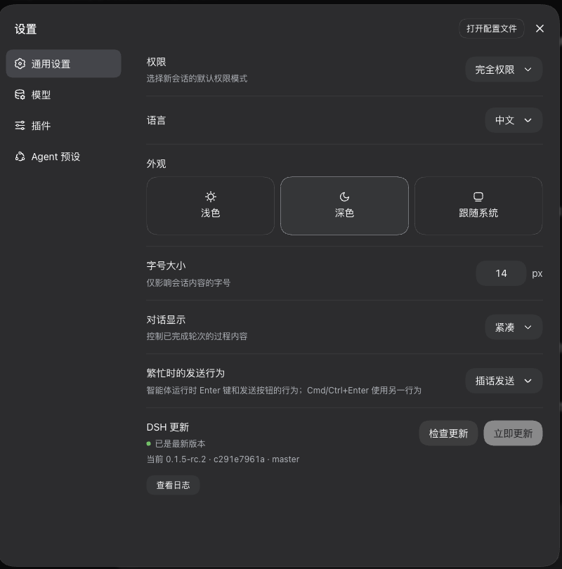

# dsh-auto-update

给 [DeepSeek Harness](https://github.com/deepseek-ai/deepseek-harness)（dsh）用的更新插件：
在 **设置 → 通用** 里加一行「DSH 更新」，有上游提交时点一下按钮就更新完。



## 它和普通「git pull + build」的区别

上游是破坏性更新重灾区，插件生态又经常跟不上；直接在正在运行的代码上
`git pull && pnpm install && pnpm run build`，再把服务一重启，很容易出现
「新版本起不来 / 插件冲突 / 端口被残留进程占着」的三连崩。本插件按下面的顺序做事：

1. **蓝绿副本构建**：更新只在 `$DSH_HOME/dsh-auto-update/slots/{a,b}` 的独立
   git worktree 里进行。主仓库、正在运行的服务、你正在用的会话都不受影响，
   也不再需要 stash 你的未提交改动。
2. **真实 profile 试运行**：构建完先在**空闲端口**上用你真实的 profile 启动一次，
   解析它打印的 token 地址并做 HTTP 校验；通过才算更新成功。
3. **插件冲突自动隔离**：试运行因某个第三方 loader entry 起不来时，自动生成
   `--patch` 覆盖层临时禁用该插件后重试（最多 8 个），而不是让整棵插件树陪葬。
   界面会列出被禁用的插件，修好后点「重新启用插件」即可恢复。
4. **独立进程安全切换**：点「重启生效」后由 `scripts/switch.mjs` 接手：
   等旧进程退出 → 清理端口上确认属于 dsh web 的残留进程 → 启动新版本并等它就绪 →
   **失败就自动用旧版本回滚**。全程写 `switch-status.json`，界面能看到真实结果。

## 功能

- **检测更新**：`git fetch` 后比对「正在运行的版本」和上游，显示当前版本 / 提交 /
  分支，以及落后几个提交
- **一键更新**：副本构建 + 试运行校验，带进度条和实时日志，关掉面板也不中断
- **一键安全重启**：先起后切、失败回滚，不需要你盯着终端
- **插件隔离与恢复**：不兼容插件临时禁用，界面可见、一键重新启用
- **运行指针**：`$DSH_HOME/dsh-auto-update/runtime.json` 记录当前运行的是哪个副本、
  哪个提交、哪个地址

## 环境要求

- 本地有一份 **git 克隆** 的 deepseek-harness（不是 npm 安装的包）
- `git` 与 `pnpm` 在 PATH 上
- 磁盘至少留出约 2 GB（蓝绿两套构建产物；pnpm 用硬链接，实际增量更小）

## 安装

```sh
# 1) 克隆到任意位置
git clone https://github.com/heshuren371/dsh-auto-update.git ~/dsh-auto-update

# 2) 接进 web profile（幂等，会先备份 profile 的 package.json）
node ~/dsh-auto-update/scripts/install.mjs

# 3) 装依赖
cd ~/.dsh/profiles/web && pnpm install
```

然后**重启 dsh web**，打开 **设置 → 通用**，最下面就是「DSH 更新」。

> 重启不好找？`sh ~/dsh-auto-update/scripts/restart-web.sh 5` 会重启 dsh web。
> 它带预检 —— 确认新进程真能起来才杀旧进程；加 `--check` 则只预检不重启。

### 第一次使用（从 npm 全局安装迁移过来）

如果你现在的 `dsh web` 是 npm 全局安装（`which dsh` 指向
`.../lib/node_modules/@deepseek-ai/dsh/...`），插件会在设置行里提示
「当前运行的不受更新管理」，并直接放开 **立即更新**：

1. 点 **立即更新** —— 在副本里构建上游代码，并用你真实的 profile 做一次试运行；
2. 试运行通过后点 **重启生效** —— 独立切换器把服务切到仓库版本，失败会自动回滚。

之后每次更新都走同一套安全流程。想少踩上游破坏性更新，可以按
「环境变量」一节切到 `DSH_UPDATE_CHANNEL=tag`（跟随发布标签而不是 master）。

### 让终端里的 `dsh` 也跟随受管版本

插件每次切换后会写一个纯文本指针 `~/.dsh/dsh-auto-update/active-entry`，
记录当前受管版本的入口。运行下面这条命令会生成一个 `~/.local/bin/dsh` shim
（该目录在你的 PATH 里排在 nvm 前面）：

```sh
node ~/Desktop/DeepSeek/dsh-auto-update/scripts/use-managed-dsh.mjs
# 新开终端后：
dsh --version      # 应显示受管版本，例如 0.1.6-alpha.1
```

- shim 优先运行 `active-entry` 指向的受管版本，指针失效时自动回退到原来的 dsh；
- 检查当前解析：`node scripts/use-managed-dsh.mjs --check`；
- 撤销：`node scripts/use-managed-dsh.mjs --remove`。

不改 shell 也可以：插件重启后的服务就是受管版本；只是终端里的 `dsh`
仍然是 npm 全局安装的版本。

## 更新插件本身

```sh
cd ~/dsh-auto-update && git pull
# 重启 dsh web 生效
```

## 卸载

```sh
node ~/dsh-auto-update/scripts/install.mjs --remove
cd ~/.dsh/profiles/web && pnpm install
# 重启 dsh web
```

卸载后可顺手删掉状态目录：`rm -rf ~/.dsh/dsh-auto-update`
（里面是试运行副本和运行指针；删了不会影响正在跑的服务，只是下次重新建副本）。

## 环境变量

| 变量 | 作用 |
| --- | --- |
| `DSH_UPDATE_REPO` | 显式指定 harness 主仓库路径（默认从 dsh 入口向上探测，兜底 `~/deepseek-harness`） |
| `DSH_UPDATE_STATE` | 状态目录（默认 `$DSH_HOME/dsh-auto-update`） |
| `DSH_UPDATE_CHANNEL` | `master`（默认，跟随分支）/ `tag`（跟随最新 `dsh-v*` 标签） |
| `DSH_UPDATE_ALLOW_ANY_ORIGIN=1` | 放宽 origin 校验（只在你确实要从别处拉代码时用） |
| `DSH_UPDATE_ENTRY` | 只给自检用：指定试运行入口 |

## 故障排查

**更新失败**：正在运行的服务没有被改动。v0.4 起插件会写一份**结构化失败报告**
（分类 + 复现命令 + 日志尾部 + 可直接粘贴的 agent 提示词），并给你三条修复路径：

- 设置行里点 **复制诊断报告** → 把提示词粘给任意 AI 代理接手；
- 设置行里点 **让 dsh 帮忙修复** → 用 `headless` profile 起一个后台 dsh 会话读报告尝试修复，
  日志在 `~/.dsh/dsh-auto-update/failures/assist-<时间>.log`；
- 命令行：`node scripts/repair.mjs`（摘要）/ `--prompt` / `--json` / `--clear` /
  `--assist [--profile headless]`。

失败报告与日志：`~/.dsh/dsh-auto-update/failures/latest.json`、`latest.log`；
流水线全程日志：`~/.dsh/dsh-auto-update/pipeline.log`。

**为什么会「构建失败」**：v0.4 起每次更新都会**新建一个全新 worktree**
（`slots/<sha7>-<时间戳>`）并重新 `pnpm install`。此前复用旧槽位时，旧版本残留的
编译产物（`MISSING_EXPORT`）和旧 `node_modules` 工作区状态（`Cannot find entry`）
都曾把新版本构建搞挂；全新副本从构造上消除这两类问题。旧副本会自动清理，
只保留正在运行的、刚构建的、以及最近失败的副本。

**报退出码 69 / "not agreed to the Xcode license agreements"**：
macOS 的 `/usr/bin/git` 是 Xcode 的 shim，Xcode 许可没接受时它会直接以 69 退出。
插件会自动改用 CommandLineTools / Xcode 自带的真实 git（启动日志里有一行 `git：<路径>`），
但你的终端 `git` 仍然会报错；而且**原生模块构建（`build:native-system` → `xcrun`/clang）
受同一许可影响**，只装 Homebrew git 并不能修复构建。推荐直接接受许可：

```sh
sudo xcodebuild -license accept     # 接受 Xcode 许可（会要求输入密码）
```

插件在点「立即更新」前会预检 `xcrun`：许可没接受时会直接提示，而不是白等两分钟构建失败。

**重启后页面打不开**：
```sh
cat ~/.dsh/dsh-auto-update/switch-status.json   # 切换器最后的状态
lsof -nP -iTCP:3080 -sTCP:LISTEN                 # 谁占着端口
tail -50 ~/.dsh/dsh-auto-update/switch.log       # 新旧进程的启动日志
```
如果是切换失败且回滚也失败（`phase: failed`），手动拉起旧版本：
```sh
node ~/deepseek-harness/apps/cli/lib/bin.js web
```

**插件被临时禁用**：设置行会列出 id。升级/替换对应插件后点「重新启用插件」，
下次更新或重启会重新加载它。

**想固定用某个标签**：`export DSH_UPDATE_CHANNEL=tag`。

## 说明

- 仓库路径自动探测（从 dsh 的 CLI 入口向上找），探测不到就假设 `~/deepseek-harness`。
  也可以显式指定：启动 dsh 前 `export DSH_UPDATE_REPO=/path/to/deepseek-harness`
- 只跟随 `deepseek-ai/deepseek-harness`；`origin` 指向别处时会拒绝更新。
  确认无误才需要 `export DSH_UPDATE_ALLOW_ANY_ORIGIN=1`
- 更新会在副本里执行 `pnpm install && pnpm run build`，也就是会运行上游代码 ——
  这是「更新 dsh」本身要求的权限，请只在你自己的机器上使用
- 安全重启只清理命令行里确认是 dsh web 的残留进程，不会碰不认识的进程；
  `runtime.json`（含 token 地址）以 0600 权限保存

## 开发

```sh
npm test                           # selftest（84 项）+ clienttest（123 项）
node --check lib/index.js          # 宿主半
node --check lib/client.js         # 客户端半
node --check lib/probe.js
node --check lib/util.js
node --check scripts/switch.mjs
node scripts/selftest.mjs          # 纯函数/失败分类单测
DSH_UPDATE_ENTRY=~/deepseek-harness/apps/cli/lib/bin.js \
  node scripts/selftest.mjs --integration   # 真实 profile 试运行（不碰 3080）
node scripts/selftest.mjs --pipeline        # 全流水线：全新副本构建+试运行（临时状态目录）
node scripts/repair.mjs --prompt            # 最近一次失败交给 agent 的提示词
node scripts/switchtest.mjs        # 切换器：外部进程安全 + 成功 + 回滚（空闲端口，不碰 3080）
node scripts/build-demo.mjs        # 生成 demo/ 下的动态插件预览代码
```

设计细节、事故复盘与安全边界见 [docs/DESIGN.md](docs/DESIGN.md)。

## License

[MIT](LICENSE)
