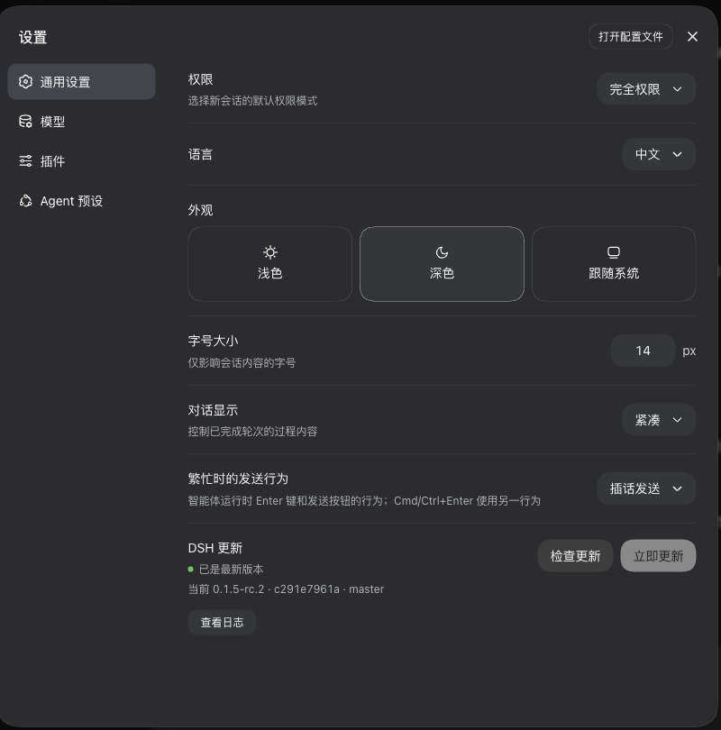

# dsh-auto-update

给 [DeepSeek Harness](https://github.com/deepseek-ai/deepseek-harness)（`dsh`）用的更新插件：
在 **设置 → 通用** 里加一行「DSH 更新」，点一下就把上游更新到本地 —— 构建通过真实 profile
试运行后**自动重启**，失败自动回滚。



## 开发者预览

本插件是非官方插件，跟随 dsh 的 `master` 开发线。上游**会**出现破坏兼容性的变更，
插件的目标不是阻止这件事，而是让每次更新都**可验证、可回滚**：

- 更新只在**全新副本**里构建（每次新建 worktree），主仓库、正在运行的服务、你正在用的会话都不受影响；
- 候选先在**空闲端口 + 你的真实 profile** 上试运行，通过才允许切换；
- 切换失败自动用旧版本回滚，并把失败原因（含可直接交给 AI 代理的修复提示词）写进失败报告。

<a id="install"></a>

## 安装

环境要求：`git`、`pnpm`、Node.js，以及一份 **git 克隆**的 deepseek-harness
（不是 npm 全局安装的包）；磁盘预留约 2 GB。

```sh
git clone https://github.com/heshuren371/dsh-auto-update.git ~/dsh-auto-update
node ~/dsh-auto-update/scripts/install.mjs
cd ~/.dsh/profiles/web && pnpm install
```

重启 `dsh web`，打开 **设置 → 通用**，最下面的「DSH 更新」就是本插件。

<a id="run"></a>

## 使用

1. 点 **立即更新**：新建副本 → `pnpm install` → `pnpm run build` → 用真实 profile 试运行；
2. 试运行通过后**自动重启**（3 秒后切换，页面自动重连）；失败则自动回滚旧版本。

后台默认每约 30 分钟检查一次上游并提前构建候选，所以多数时候点「立即更新」是**秒级**完成
（已有同提交候选时实测 133 ms）。

```sh
export DSH_UPDATE_AUTO_RESTART=0   # 改回「更新 → 手动点重启生效」两步确认
export DSH_UPDATE_CHANNEL=rc       # 避开 master 开发版：nightly / rc / alpha / stable / tag
export DSH_UPDATE_AUTO_CHECK=0     # 关掉后台预构建巡检
```

<a id="config"></a>

## 配置

| 变量 | 默认 | 作用 |
| --- | --- | --- |
| `DSH_UPDATE_CHANNEL` | `nightly` | 更新通道：`nightly`（跟随 master 分支）/ `rc` / `alpha` / `stable`（无 prerelease 标签）/ `tag`（任意最新标签）；`master`、`branch`、`release` 为别名 |
| `DSH_UPDATE_AUTO_RESTART` | 开 | 设为 `0` 关闭「更新完自动重启」 |
| `DSH_UPDATE_AUTO_CHECK` | 开 | 设为 `0` 关闭后台预构建巡检 |
| `DSH_UPDATE_AUTO_CHECK_INTERVAL_MS` | `1800000` | 巡检间隔（毫秒，允许 60000–2147483647） |
| `DSH_UPDATE_AUTO_CHECK_JITTER` | `0.2` | 巡检抖动比例（0–1） |
| `DSH_UPDATE_REPO` | 自动探测 | 显式指定 harness 主仓库路径 |
| `DSH_UPDATE_STATE` | `$DSH_HOME/dsh-auto-update` | 状态目录：副本、运行指针、失败报告 |
| `DSH_UPDATE_ALLOW_ANY_ORIGIN=1` | 关 | 放宽 origin 校验（只在你确实要从别处拉代码时用） |

标签通道带 semver 守卫：目标不高于当前运行版本时直接提示「无需更新」，不会降级，
也不会做平级空转构建。

<a id="failure"></a>

## 更新失败怎么办

失败不会动正在运行的服务。插件会写一份**结构化失败报告**（分类 + 复现命令 + 环境 +
日志尾部 + 可粘贴给 AI 代理的提示词），并给你三条修复路径：

- 设置行 **复制诊断报告** → 把提示词粘给任意 AI 代理接手；
- 设置行 **让 dsh 帮忙修复** → 用 `headless` profile 起一个后台 dsh 会话读报告尝试修复；
- 命令行：

```sh
node scripts/repair.mjs            # 摘要
node scripts/repair.mjs --prompt   # 交给 agent 的提示词
node scripts/repair.mjs --clear    # 清掉失败记录
```

报告与日志：`$DSH_HOME/dsh-auto-update/failures/latest.json`、`failures/latest.log`；
流水线全程日志：`pipeline.log`。

<a id="xcode"></a>

### macOS 报退出码 69 / Xcode 许可

`/usr/bin/git` 是 Xcode 的 shim，许可未接受时会直接以 69 退出；原生模块构建
（`xcrun`/clang）受同一许可影响，装 Homebrew git 并不能修复构建。插件会自动改用可用的
真实 git，并在更新前预检 `xcrun`，但推荐直接接受许可：

```sh
sudo xcodebuild -license accept
```

<a id="update"></a>

## 更新与卸载

```sh
# 更新插件本身
cd ~/dsh-auto-update && git pull     # 重启 dsh web 生效

# 卸载
node ~/dsh-auto-update/scripts/install.mjs --remove
cd ~/.dsh/profiles/web && pnpm install
rm -rf ~/.dsh/dsh-auto-update         # 副本与运行指针，删掉不影响正在跑的服务
```

<a id="safety"></a>

## 安全

- 更新会在副本里执行上游代码的 `pnpm install && pnpm run build` —— 这是「更新 dsh」
  本身要求的权限，请只在你自己的机器上使用；
- 试运行使用**空闲端口**，不占用 3080；试运行通过前绝不触碰正在运行的服务；
- 切换只清理命令行里确认属于本次 `prev`/`new` 入口的进程，不认识的进程一律不碰；
- 只跟随 `deepseek-ai/deepseek-harness`，`origin` 指向别处会拒绝拉取代码；
- `runtime.json`（含 token 地址）以 0600 权限保存。

<a id="dev"></a>

## 开发

```sh
npm test                              # selftest 105 项 + clienttest 158 项
node scripts/selftest.mjs --pipeline  # 全流水线：全新副本构建 + 真实 profile 试运行（临时状态目录）
node scripts/switchtest.mjs           # 切换器：外部进程安全 + 成功 + 回滚 + 版本绑定（空闲端口）
node scripts/repair.mjs --prompt      # 最近一次失败交给 agent 的提示词
node scripts/build-demo.mjs           # 生成 demo/ 下的动态插件预览
```

设计细节、事故复盘与已知限制见 [docs/DESIGN.md](docs/DESIGN.md)；
与官方 Desktop 自动更新的逐项对比见 [docs/UPSTREAM-UPDATE.md](docs/UPSTREAM-UPDATE.md)。

## 参与贡献

欢迎提 issue / PR。提交前请跑通 `npm test`、`node scripts/switchtest.mjs`，
涉及更新流水线的改动再跑一次 `node scripts/selftest.mjs --pipeline`。

## 许可证

[MIT](LICENSE)
